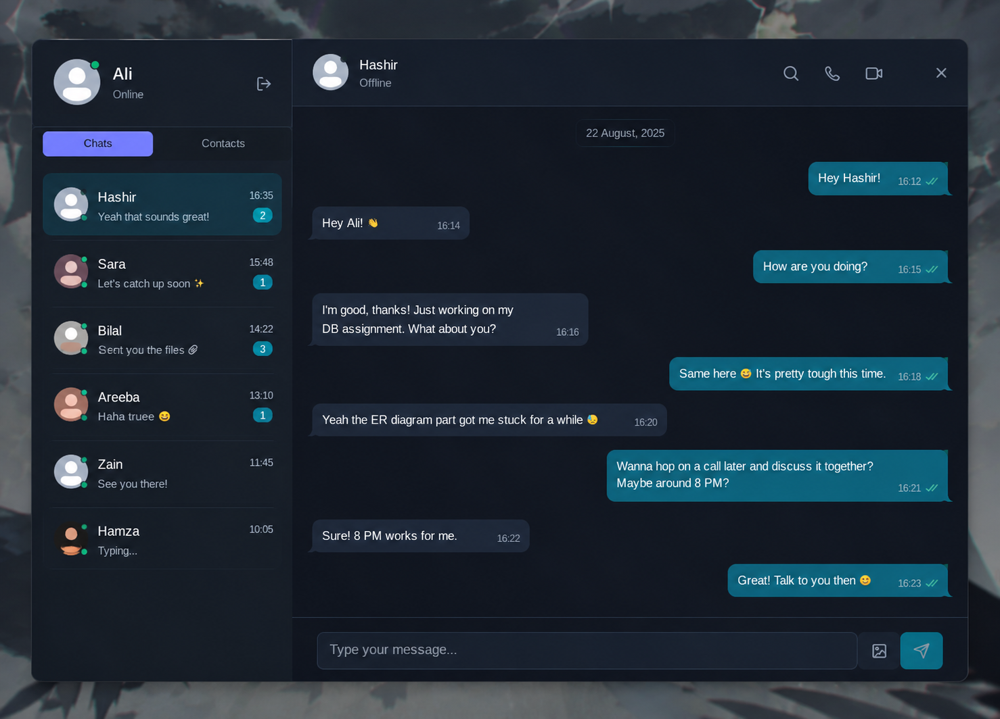

# Gosip

A modern real-time messaging app built for seamless conversations, polished UX, and fast communication.

<p align="center">
  
</p>

## Overview

Gosip is a full-stack chat application designed to provide a smooth messaging experience with a clean interface and real-time communication features. The project combines a React frontend with a Node.js backend to create an interactive, scalable chat platform.

## Features

- Real-time messaging experience
- User authentication and account flow
- Chat list and conversation management
- Responsive modern UI
- Clean, production-style frontend structure
- Backend API for message handling and user operations

## Tech Stack

### Frontend
- React
- Vite
- JavaScript
- Tailwind CSS

### Backend
- Node.js
- Express
- MongoDB
- Socket-based real-time communication

## Project Structure

```bash
Gosip/
├── backend/
│   ├── src/
│   ├── package.json
│   └── ...
├── frontend/
│   ├── public/
│   ├── src/
│   ├── package.json
│   └── ...
├── package.json
├── README.md
└── ...
```

## Getting Started

### Prerequisites

- Node.js 18+
- npm or yarn
- MongoDB running locally or configured remotely

### Installation

1. Clone the repository

```bash
git clone https://github.com/aliabbasi-sketch/Chat_App_Project.git
cd Gosip
```

2. Install dependencies for the root project and both app folders if needed

```bash
npm install
cd frontend && npm install
cd ../backend && npm install
```

### Run the app

Start the backend server:

```bash
cd backend
npm run dev
```

Start the frontend app:

```bash
cd frontend
npm run dev
```

Then open the local Vite URL shown in the terminal to use the app.

## Environment Setup

Create the required environment variables for the backend as needed, including:

- database connection string
- JWT secret or auth configuration
- email / resend configuration if enabled
- cloud storage settings if used

## Status

This project is actively being developed and improved with a focus on real-time chat functionality and user experience.

## License

This project is currently provided for educational and development purposes.
